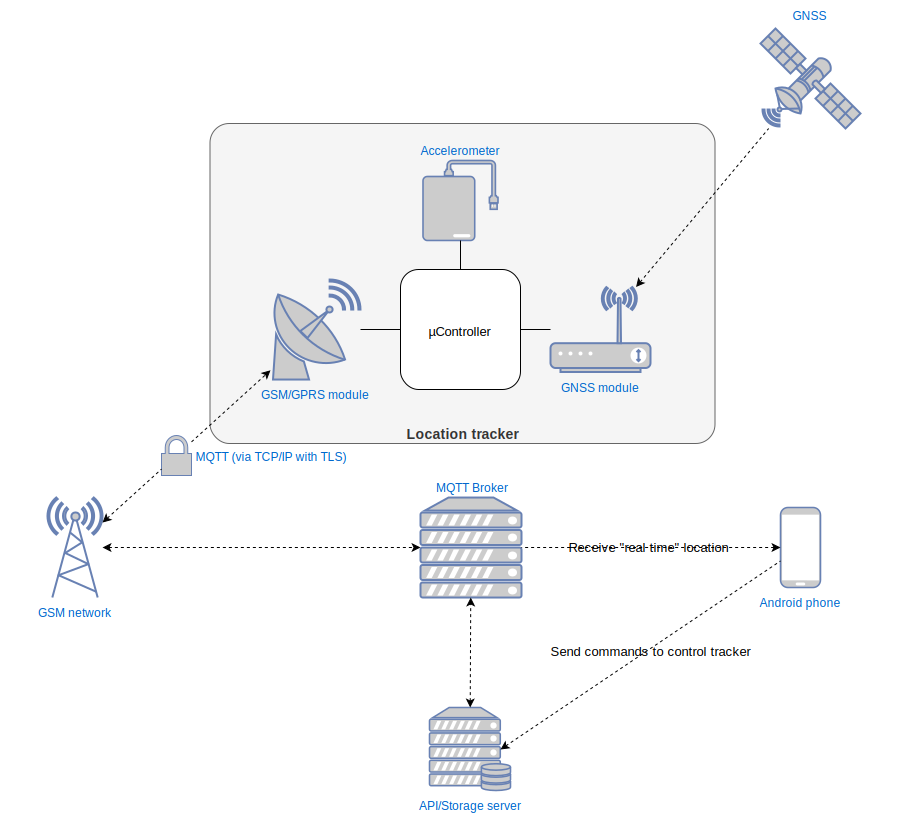

# Location Tracker
A location tracker for micro controllers. Concept:



## Installation
```
sudo ./install.sh
```

## Project structure
- `/docs`: project's documentation (including concept and model illustrations)
- `/config`: configuration and environment files for MQTT and API